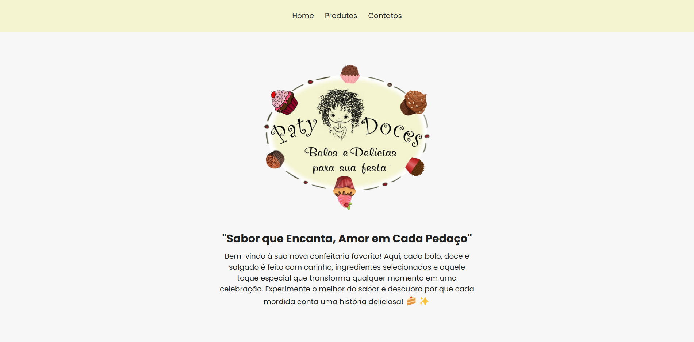
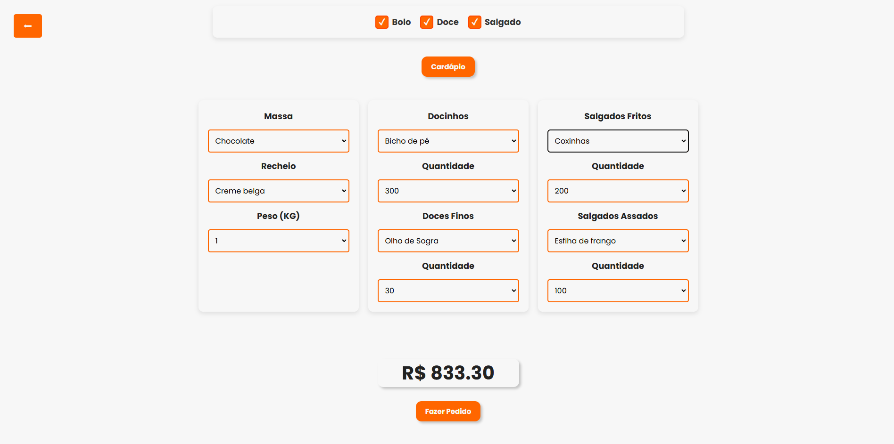

# 🍰 Paty Doces

## ✨ "Sabor que Encanta, Amor em Cada Pedaço" ✨

Bem-vindo ao projeto **Paty Doces**, uma confeitaria dedicada a trazer delícias irresistíveis para todas as ocasiões! Aqui você encontra bolos, doces e salgados feitos com carinho e ingredientes selecionados.



---

## 🚀 Tecnologias Utilizadas

Este projeto foi desenvolvido com as seguintes tecnologias:

- **HTML5** - Estrutura da aplicação
- **CSS3** - Estilização e layout
- **SASS** - Organização e otimização dos estilos
- **JavaScript** - Interatividade e dinamismo
- **GitHub** - Controle de Versão

---

## 🎨 Layout e Estilo

O site utiliza **Google Fonts (Poppins)** para uma tipografia moderna e elegante, além de um design responsivo e agradável para proporcionar a melhor experiência ao usuário.

---

## ⚙️ Funcionalidades

### - Checkbox para escolha de produtos

### - Select para escolha de produtos e quantidade

### - Calculo do preço final com base nas suas escolhas



---

## 🛒 Seções do Site

- **Home**: Apresentação da confeitaria e sua filosofia.
- **Produtos**: Exibição de bolos, doces e salgados disponíveis para venda.
- **Contato**: Informações para pedidos e atendimento.

---

## 📞 Contato

📍 Aceitamos pedidos somente aos **finais de semana e feriados**.
⏳ Os pedidos devem ser feitos com **15 dias de antecedência**.
📲 Entre em contato pelo número: [**+55 11 99999-9999**](tel:+5511999999999)

---

## 💻 Como Rodar o Projeto

1. Clone este repositório:
   ```sh
   git clone https://github.com/seuusuario/paty-doces.git
   ```
2. Acesse a pasta do projeto:
   ```sh
   cd paty-doces
   ```
3. Abra o arquivo `index.html` no seu navegador.

---

## 📜 Licença

Este projeto é de uso livre para estudos e desenvolvimento.
